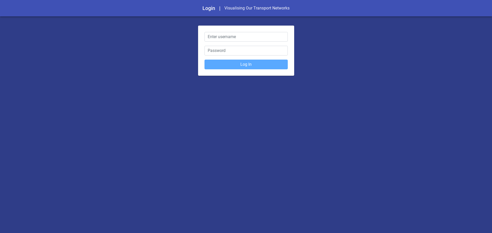
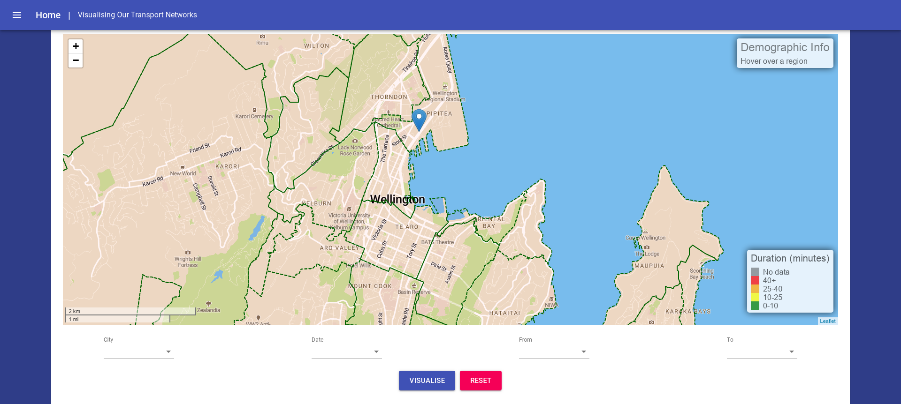
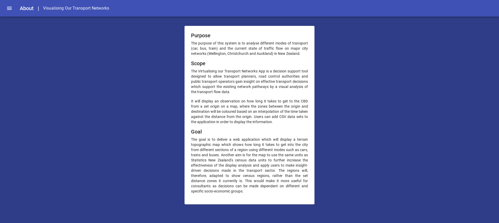

# User Manual

**Project 7:** Visualising our Transport Networks 
**Client:** Chris Vallyon 
**Date:** 11 October 2019 

This manual provides an overview of each page of the application. It also describes the actions that the user can commit when interacting with each page.

### Login Screen

#### Screenshot

#### Purpose

The Login screen is the first screen that is displayed when the user starts the web application. The screen is used to ensure that the functions of the application are only used by authorised users. If an unauthorised username and password are submitted, the screen will display an error popup. To unlock the functions of the application, the user can enter the username and password as described below. The following credentials are stored in the back-end database of the application:

Username: Project 7 
Password: 12345

#### Navigation

The user cannot commit any actions by interacting with the navigation menu as the menu is hidden. The only way the user can navigate to the Home screen is to enter the required credentials into the Login form and to then press the 'Log In' button.

#### Components

The user can interact with the following components on the screen:

- A text field for the username
- A text field for the password
- A button to authenticate the credentials and to navigate to the Home screen

### Home Screen

#### Screenshot

#### Purpose

The Home screen is the main screen of the application. The purpose of the screen is to visualise the traffic congestions of different regions over different time intervals. The map is segregated into different regions based on the geographic boundaries of the Wellington City Council area of governance. The screen also displays demographic information about each region and contains a legend to describe the travel time.

The user can specify the attribute by using the dropdown-boxes as displayed in the attribute selection panel. The values of these attributes are sourced from the database. The user can click the 'Visualise' button to initiate the animation of the traffic congestions. The animation colour-codes the different regions as described by the legend.

#### Navigation

The user can commit the following actions by interacting with the navigation menu in the top-left corner of the screen:

- Navigate to the About screen
- Logout of the application and return to the Login screen

#### Components

The user can interact with the following components on the screen:

Map

- The user can click on different regions, pan around the map, and zoom the in and out of the map

Attribute Selection Panel

- A dropdown-box for selecting the 'City' attribute
- A dropdown-box for selecting the 'Date' attribute
- A dropdown-box for selecting the 'From' attribute
- A dropdown-box for selecting the 'To' attribute
- A button for initiating the map visualisation
- A button for resetting the map to the initial state

### About Screen

#### Screenshot

#### Purpose

The About screen displays information about the project. The screen is used to outline the purpose, scope, and goals associated with the development of the application system. The user can read the information to inform themselves of the context for which this application was developed.

#### Navigation

The user can commit the following actions by interacting with the navigation menu in the top-left corner of the screen:

- Navigate to the Home Screen
- Logout of the application and return to the Login screen

#### Components

There are no components that the user can interact with on the screen.
